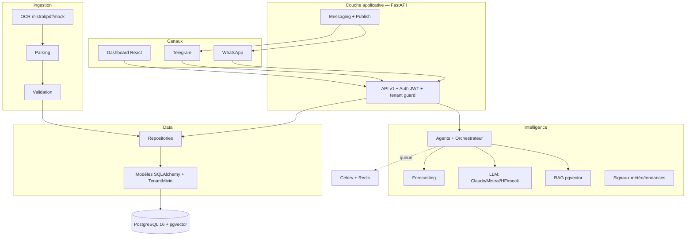

# 🏪 MyHanout AI — l'IA qui vous facilite la gestion de votre commerce

> Copilot IA pour les commerces de proximité (boucherie, épicerie, boulangerie, primeur…),
> piloté depuis **WhatsApp / Telegram** + un dashboard léger.
> Principe directeur : **human-in-the-loop · explicable · auditable · RGPD · multi-commerces.**

<p>
  
  
  
  
  
  
</p>

MyHanout AI ingère le passif documentaire du commerçant (factures PDF/photo via OCR),
structure les données, **prévoit la demande**, **alerte** sur ruptures et péremptions,
propose des **commandes de réassort explicables**, déclenche des **promos anti-gaspillage**,
et **répond/agit** par messagerie — toujours sous contrôle humain.

<p align="center">
  
  
</p>
<p align="center">
  
  
</p>

## ⚡ Démo en 1 minute (sans aucune clé API)

```bash
cp .env.example .env          # placeholders uniquement — aucune vraie clé requise
docker compose up -d --build  # postgres+pgvector, redis, api, worker, frontend
make seed                     # org démo + produits + 1 périssable en fin de vie + clients opt-in
# Dashboard : http://localhost:5173   ·   API : http://localhost:8000/docs   ·   login démo : admin / admin
```

Tout tourne **en mode mock par défaut** : OCR, LLM, images, WhatsApp, capteurs, caisse sont
simulés tant qu'aucune clé n'est fournie. Scénario pas-à-pas : **[`docs/DEMO.md`](docs/DEMO.md)**.

## 🎯 Ce que ce repo démontre

- **Architecture multi-tenant sécurisée** : garde-fou central (isolation par commerce), RBAC, audit — testé (A ≠ B).
- **Mock-first / keyless** : abstractions `Provider` partout → la démo tourne sans secret ; le réel s'active par `.env`.
- **Human-in-the-loop & explicabilité** : aucune action sortante sans validation ; chaque chiffre/suggestion porte sa raison.
- **MLOps pragmatique** : prévision → écart réel → MAE/MAPE → réentraînement versionné.
- **RGPD & socle générique** : consentement opt-in, données fictives, modules activables par type de commerce.

---

## ✨ Fonctions

| Domaine | Détail |
|---------|--------|
| 📥 Ingestion factures | OCR (Mistral + fallback PDF), drag & drop / photo WhatsApp/Telegram, **import email (IMAP)**, validation humaine, suivi **payé/non payé**, édition pré-remplie |
| 📊 Forecasting | Prévision de demande (naïf par défaut, Prophet/LightGBM en option) + saisonnalité/fêtes |
| 🛒 Réassort | Suggestions **explicables** (demande + stock + délai + signaux), 3 modes d'envoi fournisseur |
| 🔔 Promos flash | Détection fin de vie → promo IA → **affiche générée (text-to-image)** → publication **réseaux + clients opt-in (RGPD)** |
| 💶 Gestion financière | **OPEX/CAPEX** (tagging IA explicable, validé humain), **trésorerie** (alerte cash), **valorisation stock**, **marges réelles** + alertes (doublon, prix, marge, échéance) — pré-compta |
| 🌡️ Chaîne du froid | Suivi **température** des machines (HACCP) via capteurs (mock keyless ou thermomètres connectés), **alertes explicables** anti-gaspillage |
| 🔌 Intégrations | **Import JSON** + **sync DWH** + **connecteur caisse (POS)** (ingestion ventes idempotente) |
| 📱 Omni-accès | Web responsive + **PWA installable** (PC / téléphone / tablette de caisse) + WhatsApp/Telegram |
| 💬 Conversationnel | **WhatsApp & Telegram** (texte + photo→OCR) + **chat web**, même cerveau d'agents |
| 🤖 Agents IA | order, stock, finance, marketing, support, governance + **mémoire** + **éval routage** |
| 🧠 RAG | Q&A citée sur ses propres factures (pgvector) |
| 🌤️ Compagnon | Signaux **météo + tendances** intégrés aux recommandations |
| 📈 MLOps | Écart prévu/réel → MAE/MAPE → réentraînement **versionné** |
| 🛡️ Gouvernance | Multi-tenant isolé, RBAC (owner/staff/accountant/read_only), audit, RGPD |

---

## 🏗️ Architecture



Détails : [`docs/delivery/03-solution-architecture.md`](docs/delivery/03-solution-architecture.md)
(C4 + séquences), [`docs/architecture.md`](docs/architecture.md),
[`docs/data-model.md`](docs/data-model.md), [`docs/multitenancy.md`](docs/multitenancy.md).

---

## 🚀 Quickstart (démo, 100 % mock, sans aucune clé)

```bash
cp .env.example .env
docker compose up -d --build          # postgres+pgvector, redis, api, worker, frontend
make seed                             # org démo + produits + 1 périssable en fin de vie + clients opt-in
```
| Service | URL |
|---------|-----|
| Dashboard | http://localhost:5173 |
| API / Swagger | http://localhost:8000/docs |
| Health / Metrics | http://localhost:8000/health · /metrics |

Login démo (auto en dev) : `admin@myhanout.example` / `admin`.
👉 **Script de démo guidé** : [`docs/DEMO.md`](docs/DEMO.md).

### Activer le réel (tes clés dans `.env`)
HuggingFace, Claude, Mistral, WhatsApp Business, Telegram — chaque provider est optionnel
et **retombe sur le mock sans clé**. Table d'activation + déploiement prod :
[`docs/DEPLOY.md`](docs/DEPLOY.md).

```bash
# Production (frontend buildé + nginx, migrations auto)
docker compose -f docker-compose.yml -f docker-compose.prod.yml up -d --build
```

---

## 🔌 API (extrait)

`/auth/*` · `/onboarding/*` (signup, invitations) · `/stocks` · `/invoices` (upload,
approve, reject, **PATCH** édition + payé, **import/email**) · `/forecasts/{id}` ·
`/orders` (suggest, confirm 3 modes) · `/daily-entries` · `/mlops/*` ·
`/promos` (scan, **visual**, publish) · `/import` (json, dwh/sync) ·
`/finance` (treasury, inventory-value, margins, categories, expenses, classify, alerts) · `/customers` ·
`/signals` · `/chat` · `/rag/*` · `/agents/eval` · `/whatsapp/webhook` ·
`/telegram/webhook`. Détail : [`docs/api-design.md`](docs/api-design.md).

---

## 🛡️ Sécurité, RGPD & pricing
- **Isolation multi-commerces** par garde-fou central (un commerce ne voit jamais un autre).
- **RBAC** : owner / staff / accountant (multi-commerces) / read_only.
- **RGPD** : consentement explicite, minimisation, audit, mock-first (rien ne sort sans config).
- **Human-in-the-loop** : aucune action sortante sans validation ; tout est audité.
- **Pricing humain** : pas de coupure brutale (grâce, rétrogradation). Cf.
  [`docs/delivery/privacy-pricing.md`](docs/delivery/privacy-pricing.md).
- **Aucun secret en repo** : tout via `.env` (non suivi) ; `.env.example` = placeholders.
  Signaler une faille : [`SECURITY.md`](SECURITY.md).

---

## 🧰 Développement & qualité
```bash
make check        # ruff + mypy + pytest
pre-commit install
```
Stack : Python 3.11 · FastAPI · Pydantic v2 · SQLAlchemy 2.0 async · Alembic ·
Celery/Redis · PostgreSQL 16 + pgvector · React/Vite/TS/Tailwind.
Tests : sqlite (rapide) + intégration **pg+pgvector** (job CI). Migrations réversibles.
**Contribuer ? Lis [`CLAUDE.md`](CLAUDE.md)** (architecture, conventions, pièges).

---

## 📁 Structure
```
backend/    FastAPI, modèles (TenantMixin), ingestion, intelligence, messaging, workers, alembic
frontend/   Dashboard (app authentifiée) React + Vite + TS + Tailwind (dark mode) — chat, promos, factures…
website/    Site vitrine public Astro + Tailwind (SSG, SEO) — landing, tarifs, confiance/RGPD, contact
analytics/  Couche analytique : dbt (staging→marts) + Airflow (DAG ELT) + Grafana
data/seeds/ Données factices (démo)
docs/       architecture, data-model, api-design, multitenancy, configuration, data-engineering, ai-models, DEMO, DEPLOY
```
> **Cœur (fixe) vs mouvant (par client)** : ce qui est versionné = le produit ;
> ce qui change pour brancher un commerce (`.env`, données tenant, seed) est isolé.
> Carte complète : [`docs/configuration.md`](docs/configuration.md).
> Données : [`docs/data-engineering.md`](docs/data-engineering.md) · Modèles IA & MLOps : [`docs/ai-models.md`](docs/ai-models.md).
> Socle retail générique (audit + modules par vertical) : [`docs/retail-platform.md`](docs/retail-platform.md) · Roadmap : [`docs/roadmap.md`](docs/roadmap.md).
> `frontend/` = l'**app** (le commerçant connecté). `website/` = la **vitrine** publique
> (prospects, SEO). Deux fronts distincts dans le même monorepo. Cf. [`website/README.md`](website/README.md).

## 🗺️ Roadmap
Faits : OCR réel, factures (review + payé + **import email**), auth JWT/RBAC, multi-tenant,
WhatsApp+Telegram, boucle quotidienne, suggestions, promos RGPD + **affiches générées**,
**import JSON / sync DWH**, **couche financière (OPEX/CAPEX, trésorerie, marges, alertes)**,
RAG, MLOps, rate limiting, tracing, dark mode.
Prochaines briques : Prophet/LGBM en prod, connecteurs réseaux réels,
voice WhatsApp, billing enforcement. Détail : [`docs/roadmap.md`](docs/roadmap.md).

---

## 📜 Licence

[MIT](LICENSE) — librement réutilisable. Sécurité : [`SECURITY.md`](SECURITY.md).
