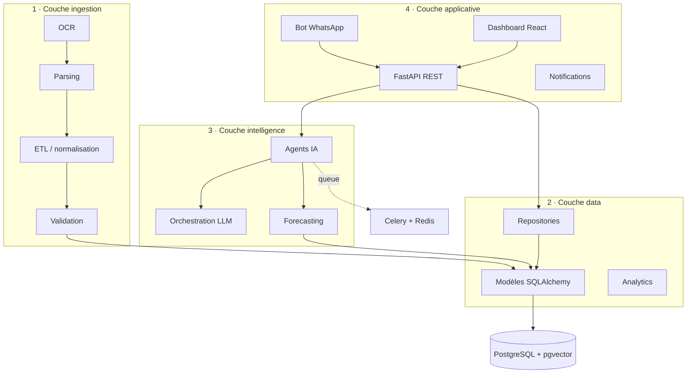

# 🏪 MyHanout AI

> Le copilot IA des commerces de proximité — bouchers, boulangers, épiceries, artisans.
> Interface principale : **WhatsApp**. Principe directeur : **human-in-the-loop, explicable, auditable**.

MyHanout AI ingère le passif documentaire du commerçant (factures PDF/photo via OCR),
structure les données, produit des **prévisions de demande/réassort**, **alerte** sur les
ruptures et les péremptions, et **répond/agit** via WhatsApp — toujours sous contrôle humain.

---

## ✨ Fonctions clés

| Domaine        | Description |
|----------------|-------------|
| 📥 Ingestion   | OCR des factures (Mistral OCR + fallback PDF), parsing, normalisation, validation |
| 📊 Forecasting | Prévisions de demande (modèle naïf par défaut, Prophet/LightGBM en option) |
| 🔔 Alertes     | Ruptures de stock, péremptions, échéances fournisseurs |
| 🤖 Agents IA   | order, stock, finance, marketing, support, governance |
| 💬 WhatsApp    | Conversation et actions, avec validation humaine sur les actions sensibles |
| 🛡️ Gouvernance | RBAC, journal d'audit, conformité RGPD |

---

## 🏗️ Architecture



Détails : [`docs/architecture.md`](docs/architecture.md) · [`docs/data-model.md`](docs/data-model.md) ·
[`docs/api-design.md`](docs/api-design.md) · [`docs/governance.md`](docs/governance.md) ·
[`docs/roadmap.md`](docs/roadmap.md).

---

## 🚀 Quickstart

Prérequis : **Docker** + **Docker Compose**.

```bash
# 1. Configuration
cp .env.example .env

# 2. Démarrer toute la stack (postgres+pgvector, redis, api, worker, frontend)
docker compose up -d --build
#   ... ou : make up

# 3. Vérifier
curl http://localhost:8000/health           # API
open http://localhost:8000/docs             # Swagger
open http://localhost:5173                  # Dashboard
```

Charger les données de démonstration :

```bash
make seed
```

Services exposés :

| Service   | URL                          |
|-----------|------------------------------|
| API       | http://localhost:8000        |
| Swagger   | http://localhost:8000/docs   |
| Frontend  | http://localhost:5173        |
| Postgres  | localhost:5432               |
| Redis     | localhost:6379               |

---

## 🧰 Développement

```bash
make help        # liste des commandes
make check       # lint (ruff) + typecheck (mypy) + tests (pytest)
make migrate     # applique les migrations Alembic
make seed        # charge les seeds
pre-commit install
```

Stack : Python 3.11 · FastAPI · Pydantic v2 · SQLAlchemy 2.0 (async) · Alembic ·
Celery/Redis · PostgreSQL 16 + pgvector · React/Vite/TS/Tailwind.

---

## 🗺️ Roadmap MVP

- [x] Scaffold mono-repo, configs, docker-compose
- [x] Modèle de données + migration initiale
- [x] Stubs ingestion / OCR (abstraction provider)
- [x] Forecasting bout-en-bout (modèle naïf sur seeds)
- [x] Agents + orchestration LLM (stubs)
- [x] API lecture + webhook WhatsApp (echo + routing)
- [x] Dashboard frontend
- [x] CI/CD + documentation
- [ ] OCR réel + extraction structurée des factures
- [ ] Forecasting Prophet/LightGBM en production
- [ ] Actions WhatsApp transactionnelles (commandes) avec validation humaine

Détail : [`docs/roadmap.md`](docs/roadmap.md).

---

## 📁 Structure du repo

```
backend/    API FastAPI, modèles, ingestion, intelligence, messaging, workers
frontend/   Dashboard React + Vite + TypeScript + Tailwind
data/seeds/ Données factices (produits, ventes, fournisseurs, factures)
docs/       Architecture, data-model, API, gouvernance, roadmap
```
