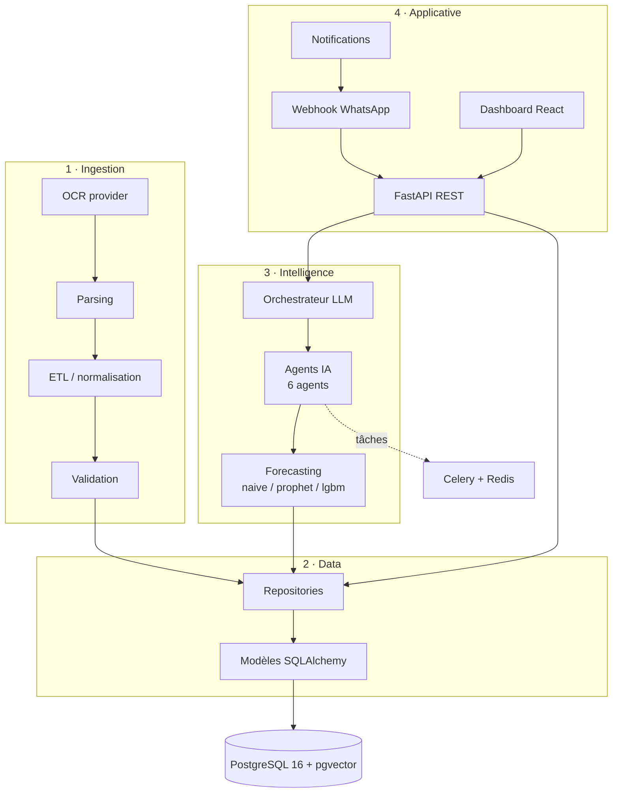

# Architecture — MyHanout AI

Architecture en **4 couches**, du document brut à l'action métier. Chaque couche
ne dépend que de la couche inférieure ; les dépendances externes (OCR, LLM,
WhatsApp, modèles de forecasting) sont derrière des **interfaces abstraites** avec
une implémentation mock par défaut, pour un fonctionnement 100 % local.

## Vue d'ensemble

## Couches

1. **Ingestion** (`app/ingestion/`) — `OCRProvider` (mock/mistral/pdf), parsing
   facture, ETL/normalisation, validation métier. Pipeline : OCR → parse → valide.
2. **Data** (`app/models/`, `app/repositories/`) — modèles SQLAlchemy 2.0 async,
   repositories, migrations Alembic. pgvector pour la recherche sémantique.
3. **Intelligence** (`app/intelligence/`) — forecasting (`ForecastModel`), agents
   (`BaseAgent` × 6), orchestration LLM (`LLMProvider` mock/mistral/claude).
4. **Applicative** (`app/api/`, `app/messaging/`, `frontend/`) — API FastAPI,
   bot WhatsApp, dashboard, notifications, exports.

## Principes transverses

- **Human-in-the-loop** : toute action sensible (commande) exige une validation.
- **Explicabilité** : chaque prévision/décision porte un champ `explanation`.
- **Auditabilité** : middleware d'audit + table `audit_log`.
- **Abstraction des providers** : bascule mock ↔ réel via variables d'env.
- **Observabilité** : logs structurés (structlog), métriques (`/metrics`), `/health`.

## Flux asynchrone (workers)

Les tâches longues (OCR d'un document, recalcul de prévisions, scan d'alertes)
sont déléguées à **Celery** (broker Redis) : `ocr_task`, `forecast_task`,
`alert_task`.
