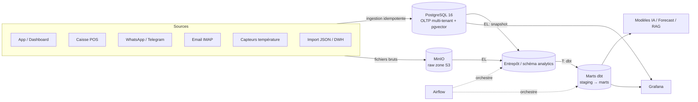

# Data Engineering — comment les données entrent et circulent

> Objectif : décrire **comment les données doivent rentrer** dans MyHanout AI, et
> comment elles circulent jusqu'aux modèles IA et aux tableaux de bord.
> Principe directeur identique au reste du produit : **mock-first / keyless** —
> rien n'exige de service externe pour tourner en local/CI ; on branche les vraies
> briques (MinIO, dbt, Airflow, Grafana) par configuration quand on est prêt.

## 0. Orchestration applicative tracée (`PipelineRun`)

En complément de l'orchestration « entrepôt » (Airflow/dbt ci-dessous, optionnelle),
le **socle applicatif** orchestre ses propres traitements de façon tracée et testable :

- **Choix techno** : **Celery (déjà présent) + un modèle `PipelineRun`**, plutôt que
  Dagster. Justification : zéro infra neuve, exécutable **in-process** (donc testable sur
  sqlite, keyless), et suffisant pour le besoin (jobs courts, déclenchement manuel/planifié).
- Un **job** = une suite d'**assets** sous un même run : `snapshot_inventory` →
  `ingest_signals` (signaux métier) → `recommend` (forecast + reco) → `scan_alerts`.
  Le job `daily` enchaîne les quatre.
- **Traçabilité** : chaque donnée produite (reco, snapshot, alerte) porte le
  `pipeline_run_id` qui l'a générée ; le run agrège `rows_processed` + `data_freshness_at`.
- **Service ML isolé** : le forecast s'appelle via `ForecastServiceClient` (`inprocess` |
  `http` → `ml-service/`) avec **fallback in-process**. `model_version` propagé aux recos.
- **Observabilité** : métriques Prometheus (`myhanout_pipeline_runs_total`,
  `…_duration_seconds`), `/health` étendu, page **Data Ops** (`/pipelines/health`).
- **Temps réel** : chaque fin d'asset publie un event sur le bus SSE (filtré tenant).

Endpoints : `GET /pipelines/runs`, `POST /pipelines/{job}/trigger`, `GET /pipelines/health`.
Code : `app/services/pipeline_service.py`. Schéma dev/E2E sqlite : `app/db/create_all.py`.

## 1. Vue d'ensemble (du terrain au modèle)



- **OLTP (PostgreSQL)** = source de vérité transactionnelle, **multi-tenant**
  (garde-fou central `app/core/tenancy.py`) + `pgvector` pour le RAG.
- **Raw zone (MinIO, S3-compatible)** = dépôt des fichiers bruts (factures PDF/photo,
  exports caisse, snapshots). Cloud-ready : MinIO en local = S3/GCS en prod.
- **Entrepôt + dbt** = transformations analytiques (staging → marts) **hors** base
  transactionnelle, pour ne jamais ralentir l'app.
- **Airflow** = orchestration planifiée (EL + dbt + qualité).
- **Grafana** = observabilité métier (ventes, marges, chaîne du froid) et technique.

## 2. Contrats d'entrée (comment les données DOIVENT rentrer)

Toute donnée entre par un **provider abstrait + mock par défaut** (cf. `CLAUDE.md` §4).
Règles non négociables à respecter par toute nouvelle source :

| Règle | Pourquoi | Où c'est appliqué |
|------|----------|-------------------|
| **Idempotence** par clé naturelle | ré-ingérer ne duplique pas | factures = hash fichier ; ventes POS = `external_ref` ; produits = `sku` |
| **Tenant explicite** | isolation commerce | jamais d'un param client : vient du JWT (`organization_id`) ; SQL brut → filtrer l'org |
| **Human-in-the-loop** sur l'écrit sensible | confiance | factures en `pending_review` → validation → écriture des lignes |
| **Explicabilité** | pas de boîte noire | chaque ligne calculée porte `explanation`/`reason` |
| **Horodatage source** | rejouabilité / séries temporelles | `sold_at`, `recorded_at`, `issue_date` toujours fournis |

### Sources et points d'entrée actuels
| Source | Entrée | Idempotence |
|--------|--------|-------------|
| Caisse (POS) | `POST /import/pos/sync` + connecteur `ingestion/pos/` | `external_ref` |
| Factures (email) | `POST /invoices/import/email` + `ingestion/email/` | hash fichier |
| Factures (drag&drop/photo/WhatsApp) | `POST /invoices/upload`, webhooks | hash fichier |
| Catalogue/ventes (export) | `POST /import/json` | `sku` |
| Capteurs température | `POST /equipment/poll` + `ingestion/sensors/` | (relevé horodaté) |
| Snapshot sortant (DWH) | `POST /import/dwh/sync` + `ingestion/dwh.py` | n/a (push) |

> **Ajouter une source** = nouvelle impl derrière l'ABC + fabrique + fallback mock +
> test avec client HTTP mocké. Voir `CLAUDE.md` §4.

## 3. ELT vs ETL — quand utiliser quoi

- **ELT (par défaut)** : on **charge** d'abord la donnée brute (OLTP + raw MinIO),
  puis on **transforme** dans l'entrepôt avec **dbt** (SQL versionné, testé). C'est
  le chemin privilégié pour l'analytique (marges, prévisions, KPIs).
- **ETL** : on transforme **avant** chargement quand c'est nécessaire au métier en
  temps réel (ex. OCR facture → parsing → validation → écriture ; classification
  OPEX/CAPEX). Ces transformations vivent dans `ingestion/` et `services/`.

Règle simple : **temps réel & métier → ETL dans l'app** ; **analytique & historique
→ ELT + dbt dans l'entrepôt**.

## 4. Le stack data local (qui tourne)

`docker-compose.data.yml` démarre les briques analytiques, **en plus** de la stack
applicative, sans rien casser :

```bash
# Stack applicative (déjà existante)
make up
# Stack data (MinIO + Grafana + Adminer), profil "data"
docker compose -f docker-compose.data.yml up -d
```

| Service | URL locale | Rôle | Identifiants démo |
|--------|-----------|------|-------------------|
| MinIO (console) | http://localhost:9001 | Raw zone S3 (factures, snapshots) | `minioadmin` / `minioadmin` |
| MinIO (API S3) | http://localhost:9000 | endpoint S3-compatible | idem |
| Grafana | http://localhost:3000 | dashboards métier/tech | `admin` / `admin` |
| Adminer | http://localhost:8081 | explorer Postgres | serveur `postgres`, user `myhanout` |

> **Cloud-ready** : en prod, remplace MinIO par S3/GCS (même API), Grafana managé,
> Postgres managé + pgvector. Aucune ligne de code applicatif à changer — que des
> variables d'environnement.

## 5. dbt — transformations analytiques

Projet dans `analytics/dbt/`. Convention en 2 couches :

- `models/staging/` : 1 vue par table source, nettoyée/typée (`stg_*`).
- `models/marts/` : tables métier agrégées (`mart_*`) consommées par Grafana et l'IA.

```bash
cd analytics/dbt
cp profiles.example.yml ~/.dbt/profiles.yml   # pointe vers ton Postgres
dbt deps && dbt build                          # run + tests (schema.yml)
```

Marts fournis (exemples) : `mart_daily_sales`, `mart_product_margin`,
`mart_cold_chain` (température par équipement/jour). Tests dbt (`not_null`,
`unique`, `relationships`) garantissent la qualité avant exposition.

## 6. Airflow — orchestration

DAG d'exemple : `analytics/airflow/dags/myhanout_elt.py`. Pipeline quotidien :

```
extract_oltp_snapshot  ->  load_raw_minio  ->  dbt_build  ->  dbt_test  ->  refresh_grafana
```

- Idempotent (rejouable par date d'exécution `ds`).
- En local, Airflow est optionnel (lourd) ; le DAG est exécutable tel quel sur une
  instance Airflow 2.x. Sans Airflow, les mêmes étapes tournent via `make` / cron.

## 7. Grafana — observabilité

- **Source de données** : Postgres (datasource provisionnée dans
  `analytics/grafana/provisioning/`).
- **Dashboards métier** : ventes & marges (depuis les marts dbt), **chaîne du froid**
  (alertes température), trésorerie.
- **Technique** : si `OTEL_ENABLED=true`, les traces/metrics OpenTelemetry peuvent
  être routées vers une stack d'observabilité (hors périmètre de ce compose).

## 8. Qualité & gouvernance des données

- **Tests dbt** sur les marts (non-null, unicité, relations).
- **Idempotence** testée côté app (POS, factures, import JSON).
- **Audit** (`audit_log`) sur toute écriture sensible.
- **RGPD** : la raw zone ne contient pas de donnée client non consentie ; les
  exports DWH/snapshots sont tenant-scopés et configurables (rien ne sort sans `.env`).

## 9. Checklist « brancher le réel »

1. `.env` : `DATABASE_URL` (pg managé), `DWH_TARGET=http` + `DWH_URL`, `POS_CONNECTOR=http` + `POS_URL`, `SENSOR_PROVIDER=http` + `SENSOR_HTTP_URL`.
2. MinIO/S3 : créer le bucket `myhanout-raw` (la console MinIO le fait en 1 clic).
3. dbt : `profiles.yml` → entrepôt ; `dbt build`.
4. Airflow : déposer `myhanout_elt.py` dans `dags/`, activer le DAG.
5. Grafana : importer les dashboards depuis `analytics/grafana/`.

Voir aussi : `docs/ai-models.md` (modèles IA & MLOps), `docs/DEPLOY.md` (prod),
`docs/architecture.md`, `CLAUDE.md` (règles d'or).
