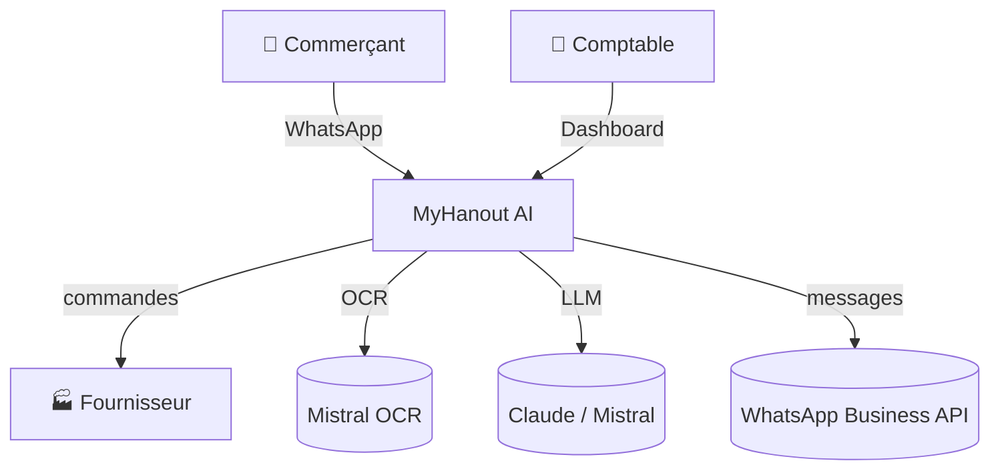
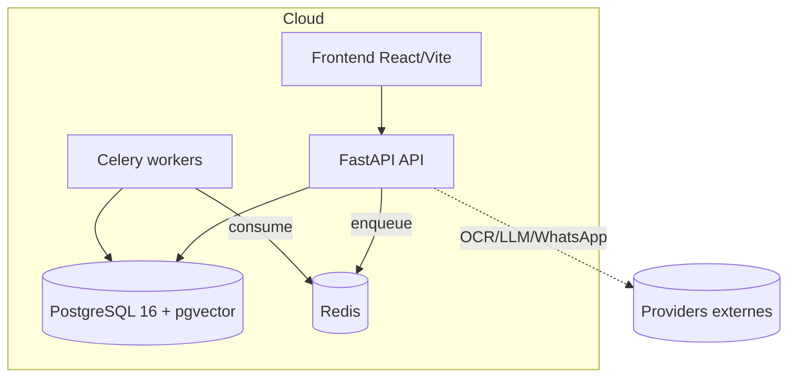
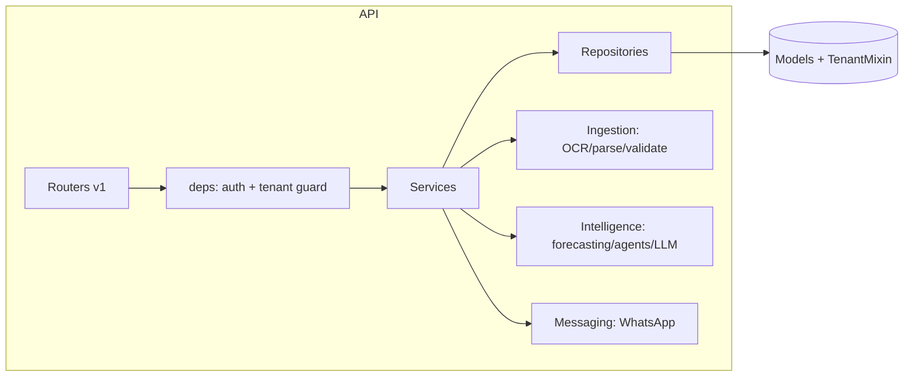
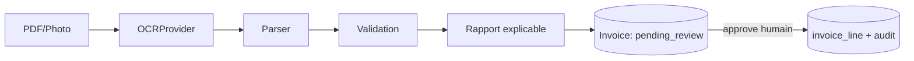
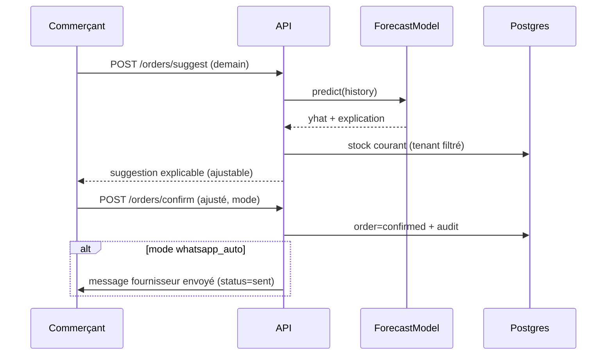
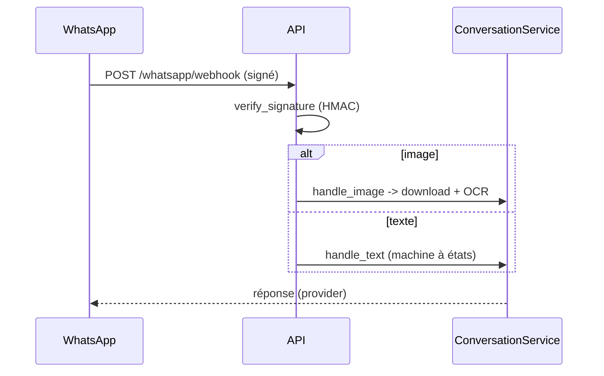
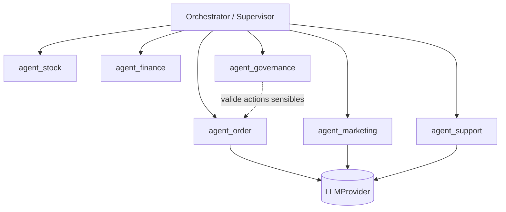
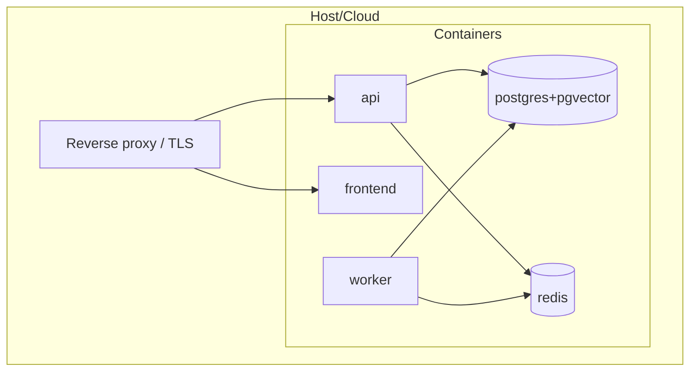

# 3 · Solution Architecture — MyHanout AI

Architecture en 4 couches (ingestion → data → intelligence → applicative), providers
externes derrière des interfaces abstraites mockables.

## C4 — Niveau 1 : Contexte

## C4 — Niveau 2 : Conteneurs

## C4 — Niveau 3 : Composants (API)

## Data Flow — Ingestion facture

## Sequence — Suggestion → commande (human-in-the-loop)

## Sequence — Webhook WhatsApp (texte/image)

## Agent Architecture

- Intent détecté → routage vers l'agent ; `agent_governance` impose la validation
  humaine sur les actions sensibles. Interface commune `BaseAgent` (run/explain/actions).

## Deployment Diagram

## Infrastructure
- **Local/dev** : `docker compose up` (postgres+pgvector, redis, api, worker, frontend).
- **Cible cloud (V2)** : conteneurs managés (ECS/Cloud Run), Postgres managé + pgvector,
  Redis managé, secrets via gestionnaire (SSM/Secret Manager), CI/CD GitHub Actions.
- **Observabilité** : logs structurés (structlog), métriques Prometheus (`/metrics`),
  healthchecks ; tracing (V2).
