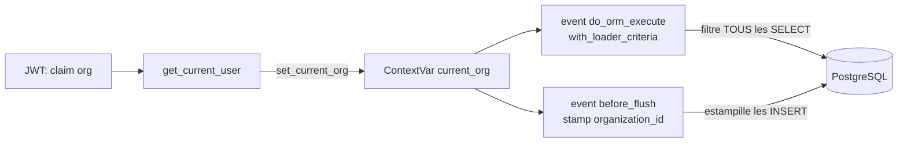

# Multi-tenant & rôles métier — MyHanout AI

## Isolation des données (sécurité, pas convention)

Chaque commerce est une **organisation** (tenant). Toute table métier (`product`,
`stock`, `sale`, `supplier`, `invoice`, `order`) porte `organization_id`
(via `TenantMixin`).

L'isolation est garantie par un **garde-fou central** (`app/core/tenancy.py`), pas
par un filtre répété dans chaque requête :

- Le tenant courant provient **exclusivement du token** (claim `org`), jamais d'un
  paramètre client.
- `do_orm_execute` applique `with_loader_criteria(TenantMixin, ...)` → tous les
  SELECT ORM (y compris `session.get`, jointures, relations) sont filtrés.
- `before_flush` estampille `organization_id` sur les INSERT.
- **Limite** : les requêtes SQL brutes (hors ORM) ne sont pas filtrées → à éviter
  sur les tables tenant. Test d'isolation explicite : `tests/test_tenancy.py`.

## Rôles (RBAC via `membership`)

Un utilisateur appartient à une ou plusieurs organisations via `membership`
(le **comptable** peut gérer plusieurs commerces).

| Rôle         | stocks | invoices | forecasts | orders | finance | admin (inviter) |
|--------------|:------:|:--------:|:---------:|:------:|:-------:|:---------------:|
| owner        |   ✅   |    ✅    |    ✅     |   ✅   |   ✅    |       ✅        |
| staff        |   ✅   |    ✅    |    ✅     |   ✅   |   —     |       —         |
| accountant   |   ✅   |    ✅    |    ✅     |   ❌   |   ✅    |       —         |
| read_only    |   👁️   |    👁️    |    👁️     |   ❌   |   —     |       —         |

> Le comptable lit et saisit les factures/finance mais **ne peut pas envoyer de
> commande fournisseur** (pas de scope `orders`).

## Onboarding self-service

`POST /onboarding/signup` (créer commerce → owner) → `POST /onboarding/products` &
`/suppliers` (rattachés automatiquement à l'org) → `POST /onboarding/invitations`
(owner invite, choisit le rôle) → `POST /onboarding/invitations/accept` (le membre
rejoint l'org). Migration `0003` rattache les données existantes à une org
`default` puis passe `organization_id` NOT NULL.
